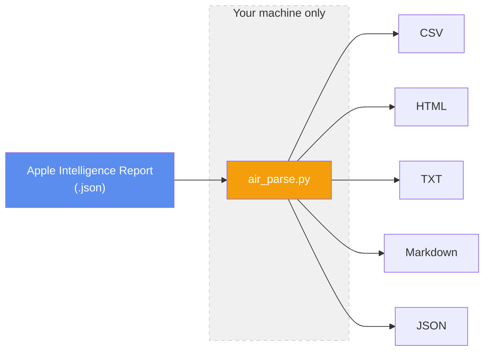

# Apple Intelligence Report Parser

Reads the Apple Intelligence Report JSON that macOS exports from **Settings > Privacy & Security > Apple Intelligence Report**, and writes CSV, HTML, TXT, Markdown, and JSON you can actually read.

Stdlib-only Python. No dependencies, no installer, no network access, ever.



## What is an "Apple Intelligence Report"?

Since macOS started routing some Apple Intelligence requests to Apple's servers (Private Cloud Compute) instead of running them on your Mac, Apple added a report so you can see exactly what happened: which app asked for what, when, whether it stayed on-device or left for the cloud, and (for cloud requests) the cryptographic attestation proving which code ran on Apple's servers.

To generate it on your Mac:

1. Open **System Settings**
2. Go to **Privacy & Security**
3. Scroll down to **Apple Intelligence Report**
4. Click it, then export/save the report as a `.json` file

The export is one giant minified line of JSON. Prompts are logged as escaped Swift `PromptTemplateInfo(...)` serializations, and every Private Cloud Compute request carries a base64 X.509 attestation bundle. None of that is meant to be read directly, and that's what this tool is for. See `docs/report-format.md` for the full schema this tool parses against.

## Why this tool exists

The Apple Intelligence Report export is a single minified line of JSON with escaped Swift serializations and base64 attestation bundles. Reading it by hand is impractical. This tool turns it into structured, readable output in five formats, with a few things that matter:

- **Correct timezone handling.** `--tz` accepts `local`, `utc`, a numeric offset, or any IANA timezone name. Timestamps are converted accurately, not assumed to be any single zone.
- **Redaction built in.** `--redact` replaces prompt and response text with a length and SHA-256 hash, so you can share the shape of your usage (timestamps, apps, origin, counts) without exposing what you said or what came back.
- **Five output formats.** CSV (with formula-injection guarding), HTML (with filtering, sorting, pagination, and expandable rows), plain text, Markdown, and JSON.
- **Security by default.** Stdlib-only Python, zero network calls, no subprocess, no `eval`/`exec`. The tool refuses to write into OS directories and refuses to overwrite existing output unless you pass `--force`.

## Requirements

- Python 3.9 or newer (uses only the standard library: `argparse`, `csv`, `hashlib`, `html`, `json`, `re`, `datetime`, etc.)
- No `pip install`, no `requirements.txt`, no network access at any point
- Tested against reports generated by macOS 26/27 ("Golden Gate"). See [Known limitations](#known-limitations) if you're on something else.

## Installation

**Option A: Clone the repo (recommended)**

```sh
git clone https://github.com/ruangraung/apple-intelligence-report-parser.git
cd apple-intelligence-report-parser
```

**Option B: Download just the script (single file, no dependencies)**

```sh
curl -O https://raw.githubusercontent.com/ruangraung/apple-intelligence-report-parser/main/air_parse.py
```

Or with `wget`:

```sh
wget https://raw.githubusercontent.com/ruangraung/apple-intelligence-report-parser/main/air_parse.py
```

That's it. No `pip install`, no virtual environment, no dependencies. Just run it with `python3`.

## Quick start

Try it on a synthetic report first. It touches nothing of yours and is safe to run immediately:

    python3 air_parse.py --demo --out air_demo

Parse a real report:

    python3 air_parse.py Apple_Intelligence_Report.json --tz local --out air_parsed

## Usage

### Input

| Flag | Default | What it does |
|---|---|---|
| `report` | (required unless `--demo`) | Path to the Apple Intelligence Report JSON |
| `--demo` | off | Run on a built-in synthetic report and exit (ignores `report`) |

### Output

| Flag | Default | What it does |
|---|---|---|
| `--out` | `air_parsed` | Output directory |
| `--formats` | `csv,html,txt,md,json` | Comma-separated subset of formats to write |
| `--tz` | `local` | Timezone for the "Local" columns: `local`, `utc`, a numeric offset (`+7`, `-4.5`), or an IANA name (`Asia/Jakarta`) |
| `--max-content` | `2000` | Truncate each request/response after N characters; `0` for no limit |
| `--force` | off | Overwrite existing output files instead of refusing |

### Privacy

| Flag | Default | What it does |
|---|---|---|
| `--redact` | off | Replace request/response text with a length and SHA-256 hash, so you can share the shape of your usage without the content |
| `--no-csv-guard` | off | Disable CSV formula-injection neutralization (leave this on unless you have a specific reason not to) |

### Examples

Specify a timezone:

    python3 air_parse.py report.json --tz +7              # numeric offset (WIB/Jakarta)
    python3 air_parse.py report.json --tz -5              # numeric offset (EST)
    python3 air_parse.py report.json --tz Asia/Jakarta     # IANA name
    python3 air_parse.py report.json --tz America/New_York # IANA name
    python3 air_parse.py report.json --tz Europe/London    # IANA name
    python3 air_parse.py report.json --tz Asia/Tokyo       # IANA name
    python3 air_parse.py report.json --tz Australia/Sydney # IANA name
    python3 air_parse.py report.json --tz utc              # UTC

Redact content before sharing:

    python3 air_parse.py report.json --redact --out air_redacted

Choose specific formats:

    python3 air_parse.py report.json --formats html,md

## Output formats

| Format | What it is |
|---|---|
| HTML | Self-contained page (no CDN, no external CSS/JS) with filter, sort, pagination, expandable rows, dark mode, and an origin breakdown bar |
| MD | Markdown with a metadata table, per-request headings, and summary counts. Reads cleanly in Obsidian and similar tools |
| TXT | Plain text summary with per-request detail and count tables |
| CSV | Spreadsheet-ready, with a formula-injection guard on by default |
| JSON | Machine-readable structured output |

## Exit codes

| Code | Meaning |
|---|---|
| 0 | Success |
| 1 | Input error (missing file, invalid JSON, unknown format) |
| 2 | Output files already exist without `--force` |
| 3 | Refused output location (an OS path, or the input file itself) |

## Known limitations

- **The report format is not a stable, documented Apple API.** This tool parses against the schema Apple happens to export today (see `docs/report-format.md`). A macOS update could change field names, nesting, or content encoding at any time and break parsing without warning. If a future export looks wrong or fields show up empty, that's the likely cause. Please open an issue with the (redacted) schema difference.
- **Only tested on macOS 26/27 ("Golden Gate").** Reports from other OS versions may parse fine, partially, or not at all.
- **Requires Python 3.9+.** There is no pinned interpreter check; older Pythons will fail with a syntax or import error rather than a friendly message.
- **Prompt extraction is best-effort.** Prompts are frequently wrapped in Swift `PromptTemplateInfo(...)` serializations. The parser looks for common variable-binding keys (`userPrompt`, `prompt`, `userContent`, `doc`, `freeformStoryPromptQuery`, etc.), but a template using an unrecognized key will fall through to showing the raw serialization instead of clean text.
- **`useCase` to human-readable "trigger" mapping is a lookup table**, not a general parser. Use cases Apple hasn't shipped yet, or has renamed, will show up as their raw identifier instead of a friendly label.
- **Not affiliated with Apple.** This is not an Apple tool and is not officially supported by Apple in any way.

## Privacy

This tool processes data that includes your prompts and the model's responses, in plain text, entirely on your machine.

- **Zero network calls.** The entire tool is a single Python file using only the standard library. It reads one file you specify and writes to a directory you specify, nothing else.
- **No subprocess, no `eval`/`exec`, no dynamic imports.** You can read the whole implementation in `air_parse.py`.
- **Output is as sensitive as the input.** Every file this tool writes (CSV, HTML, TXT, MD, JSON) contains your prompts and the model's replies in plain text, unless you pass `--redact`. Keep parsed output out of synced folders, chats, issue trackers, and repositories.
- **`--redact`** replaces request/response text with a length and SHA-256 hash so you can share the *shape* of your usage (timestamps, apps, origin, counts) without the content.
- **Output path safety.** The tool refuses to write into operating system locations (`/usr`, `/System`, `/bin`, etc.) and refuses to overwrite existing output unless you pass `--force`.
- See [NOTICE](NOTICE) for the full disclaimer.

## License

MIT. See [LICENSE](LICENSE) for the full license text, or <https://opensource.org/license/MIT> for reference.
